# BoraProTreino — Plataforma de Gestão para Saúde e Fitness

> Aplicação Full Stack em produção para conectar alunos a Personal Trainers e Nutricionistas,
> com gestão administrativa, financeira e de treinos.

**Produção:** [boraprotreino.com.br](https://boraprotreino.com.br)

> O repositório principal é privado (projeto com sócios). Este repositório documenta a arquitetura,
> stack técnica e funcionalidades implementadas.

---

## Stack Técnica

| Camada | Tecnologias |
|---|---|
| **Back-end** | Java 17 · Spring Boot 3 · Spring Security · JWT · JPA/Hibernate · Flyway · Maven |
| **Front-end Web** | React 18 · TypeScript · Vite · Chakra UI · Tailwind CSS |
| **Mobile** | React Native · Expo SDK · APK Android |
| **Banco de Dados** | MySQL · 47 tabelas · 204 migrações versionadas via Flyway |
| **Cloud** | AWS EC2 (back-end) · AWS S3 (mídias/vídeos) |
| **Infra** | Nginx · Docker · CI/CD pipeline (GitHub Actions → EC2) |
| **Integrações** | Stripe (pagamentos, Connect, Webhooks) · WebSocket STOMP · Gmail SMTP |
| **API** | REST · Swagger/OpenAPI · Autenticação JWT + Guest Token |

---

## Funcionalidades

### Perfil Personal Trainer

- **Dashboard** com checklist de ativação, alertas de alunos sem treinar, planos expirando e inadimplentes
- **Gestão de clientes** com filtros inteligentes (sem treino, plano expirando, inadimplentes)
- **Perfil completo do aluno**: peso, ACWR, sessões/mês, antropometria, contratos e histórico
- **Criação de planos de treino** com grupos musculares, séries, cargas e vídeos de exercícios
- **Templates de treino** reutilizáveis para agilizar a criação de planos
- **Biblioteca de exercícios** personalizada com vídeos via S3
- **Agenda** com visualização mensal/semanal/lista, disponibilidade configurável e agendamentos
- **Treino Assistido** em tempo real via WebSocket (STOMP): seleciona aluno, escolhe plano ou monta na hora
- **Integração Stripe Connect**: onboarding bancário, recebimento de pagamentos no marketplace
- **Histórico financeiro** com receita mensal, total, ticket médio e listagem de transações
- **Network B2B**: busca e conexão entre Personal Trainers e Nutricionistas
- **Mensagens** diretas com alunos e profissionais parceiros

### Perfil Aluno

- **Dashboard** com tracker de hidratação e acesso rápido aos planos
- **Meus Planos de Treino**: visualiza grupos musculares, exercícios com vídeo e registra conclusão
- **Treino Assistido**: aluno acessa a sessão pelo QR Code gerado pelo personal
- **Minha Evolução**: gráfico de variação de peso e medidas ao longo do tempo
- **Meus Agendamentos**: confirmação e histórico de sessões marcadas
- **Encontrar Personal / Nutricionista**: busca e contratação de profissionais
- **Marketplace Digital**: compra de planos e conteúdos digitais

### Sistema

- **RBAC com 5 perfis**: PERSONAL · NUTRITIONIST · CLIENT · ADMIN · GUEST
- **Sessões para convidados** via QR Code (token JWT separado, sem necessidade de cadastro)
- **Flyway**: 204 migrações versionadas garantindo integridade em todos os ambientes
- **Pipeline CI/CD**: GitHub Actions com pre-flight de schema, build, testes e deploy automático na EC2
- **Stripe Webhooks**: processamento assíncrono de eventos de pagamento
- **Swagger UI** em  com documentação completa da API

---

## Arquitetura

\
---

## Screenshots

### Tela de Login
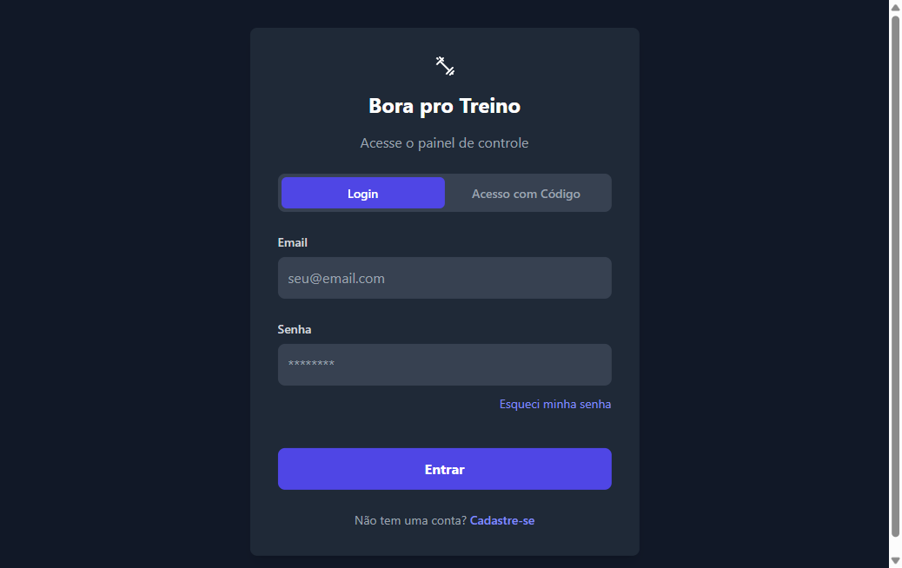

### Personal — Dashboard

### Personal — Gestão de Clientes
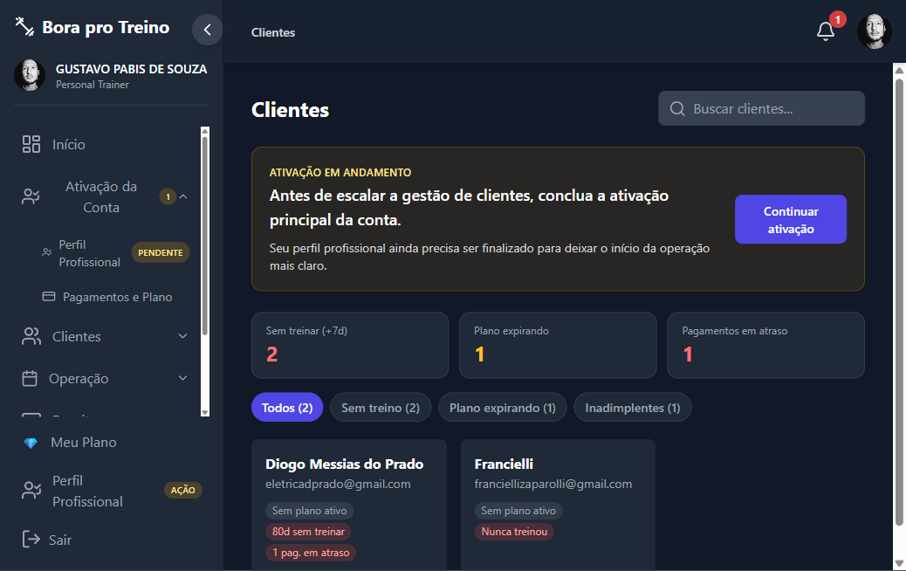

### Personal — Perfil do Aluno
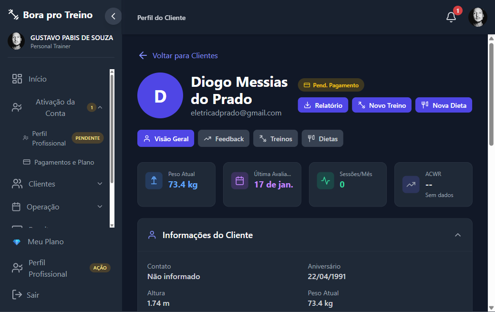

### Personal — Agenda (Calendário Mensal)
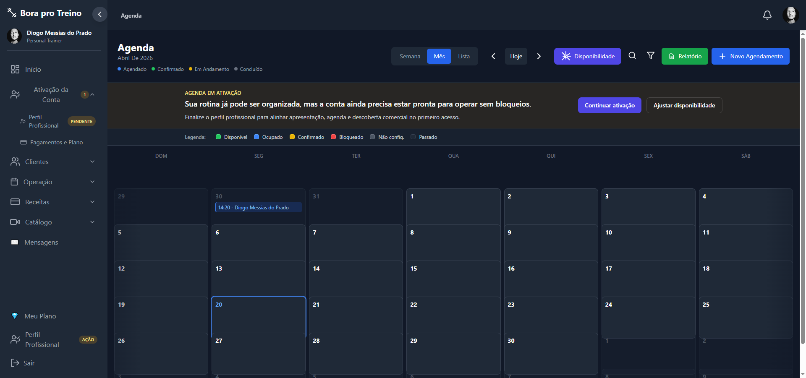

### Personal — Treino Assistido (Início de Sessão)
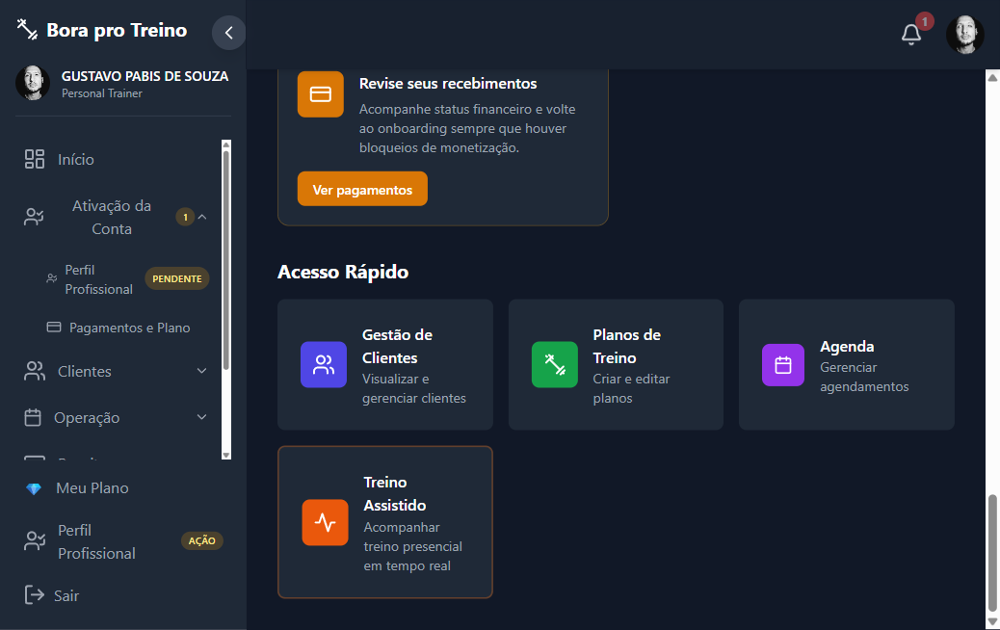

### Personal — Treino Assistido (Configuração)
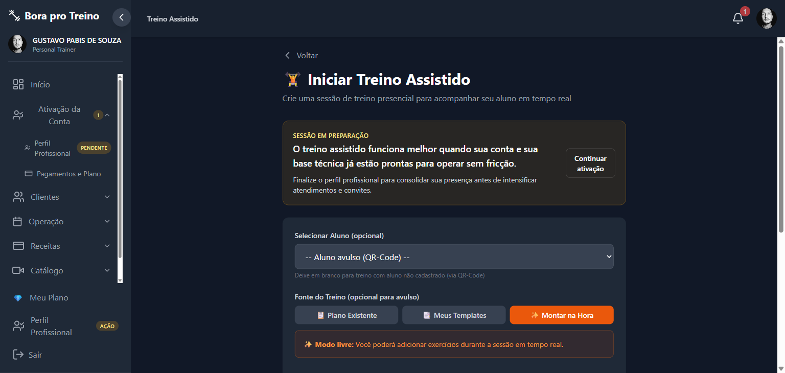

### Personal — Planos de Treino
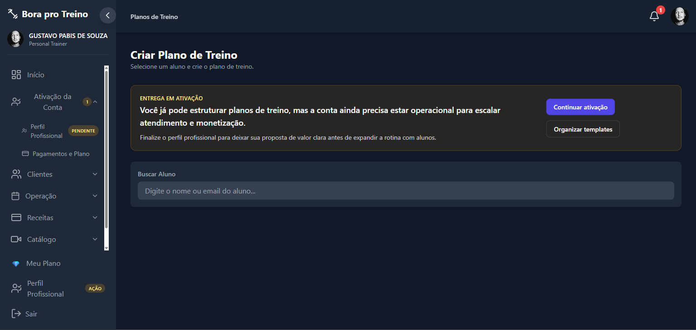

### Personal — Biblioteca de Exercícios
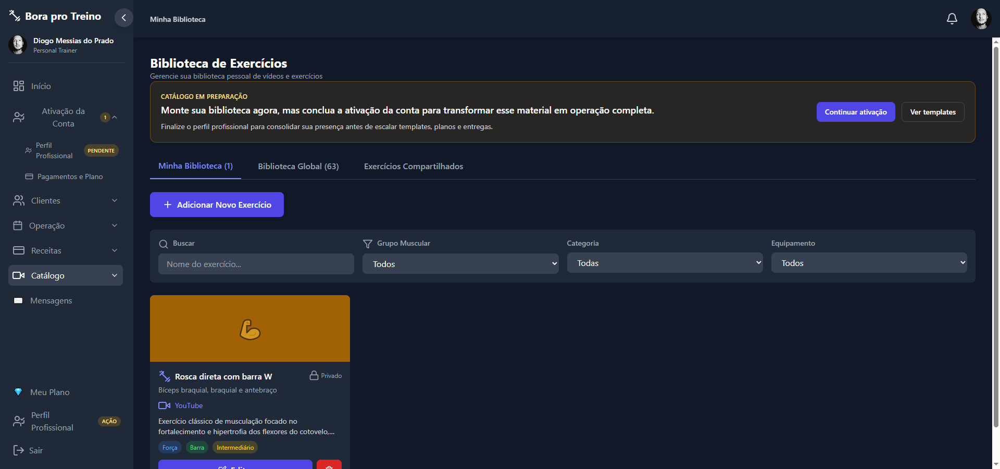

### Personal — Templates de Treino
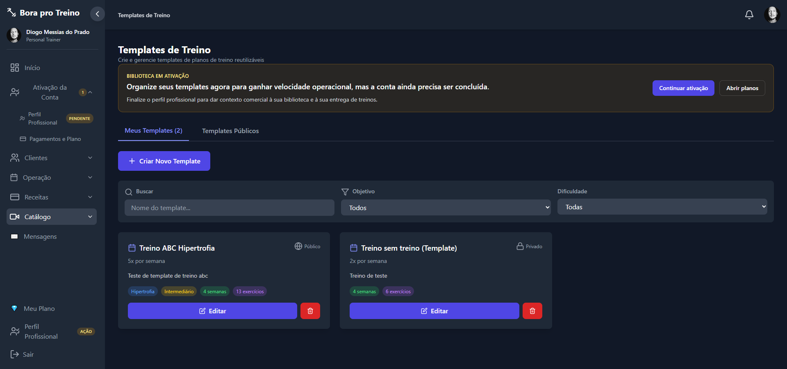

### Personal — Histórico Financeiro
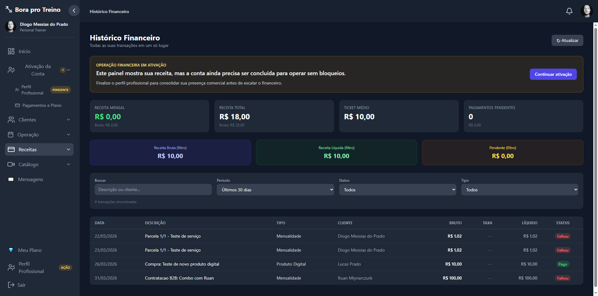

### Network — Encontre Profissionais
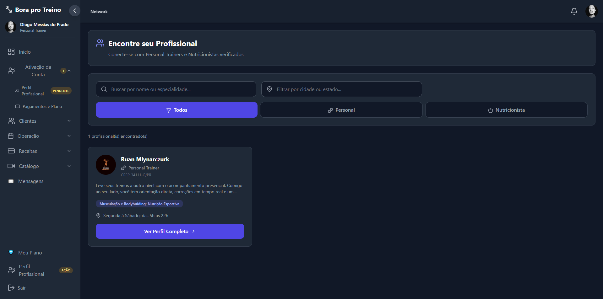

### Aluno — Dashboard
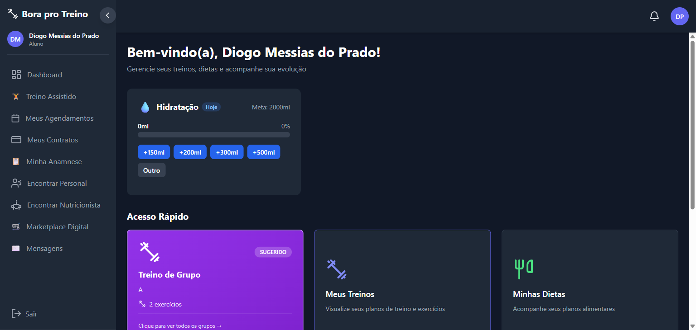

### Aluno — Meus Planos de Treino
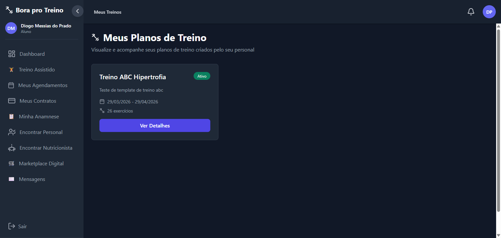

### Aluno — Detalhes do Plano
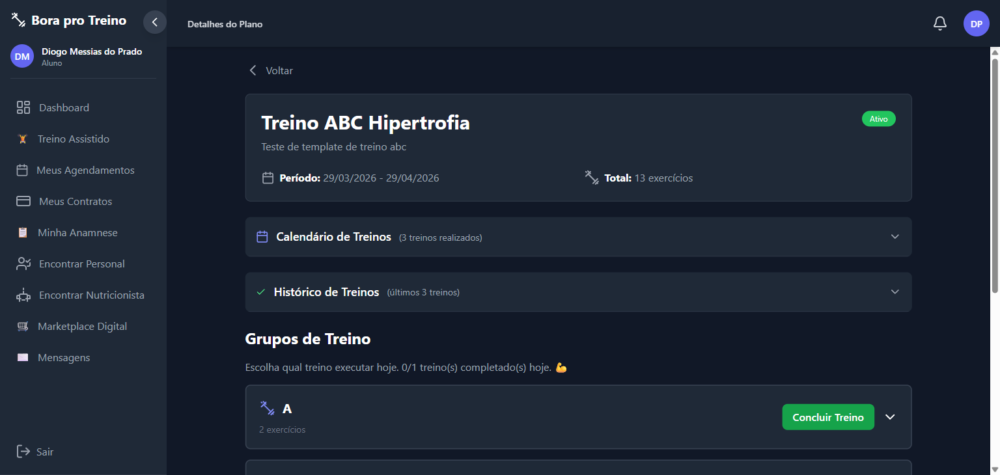

### Aluno — Minha Evolução
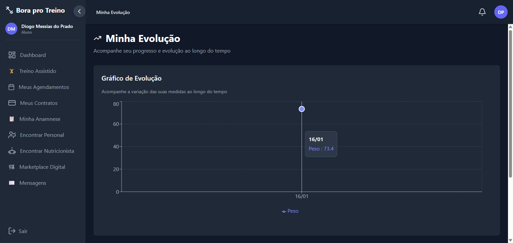

---

## Autor

**Diogo Messias do Prado**
[devdiogoprado@gmail.com](mailto:devdiogoprado@gmail.com) · [linkedin.com/in/diogo-messias-do-prado-479a552a6](https://linkedin.com/in/diogo-messias-do-prado-479a552a6) · [github.com/diogoMprado](https://github.com/diogoMprado)
